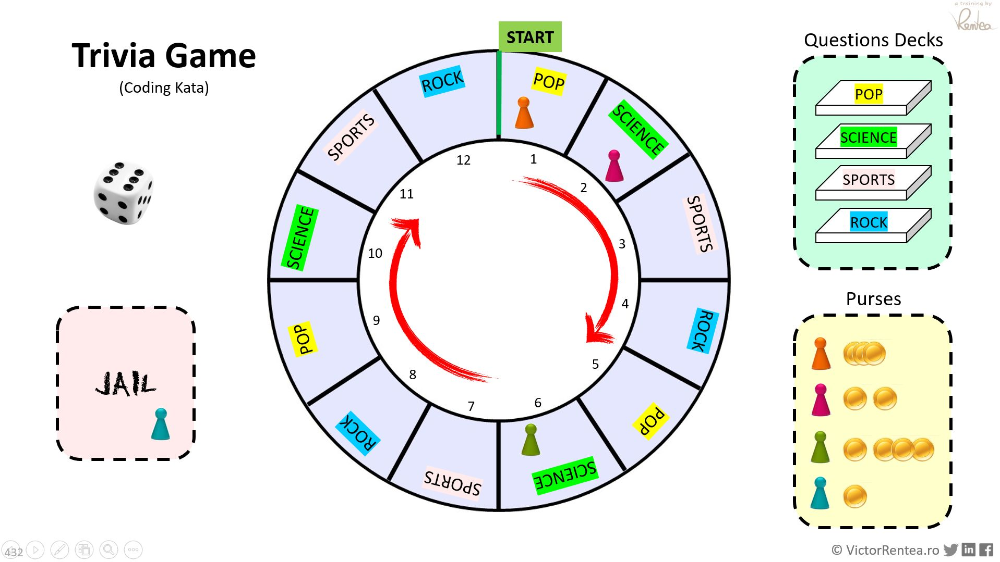

# Trivia Refactoring Kata
Created by Victor Rentea
Others available on [kata-log.rocks](https://kata-log.rocks/)

## The problem
Here is a preview of a game in action.

Each turn a player: rolls the dice and has to answer to a question from the deck corresponding to its current position. If the answer is correct [s]he gets coins. If incorrect, [s]he is sent to the prison. The board has 12 positions.

You should discover more the details from actual code, just like in real-life. Good luck!

Additionally, you could run the PlayGame.main() to actually play the game to get the feeling.

## Let there be tests!
Once upon a time, there was an ugly implementation of the Trivia Game.

Someone once noticed that as long as the same input is provided to the system, 
it will print the same output at the console. So that guy then had the idea to 
Copy-Paste the old implementation (to GameBetter.java), and write a test
that using a LOT of random inputs would call both the old system and the NEW system with the same inputs.
Many-many times. 10.000 times. And then the test would then just verify that the console output 
remained the same despite your refactorings.

This is called the "Golden Master Method", and it was used to build GameTest. 

## The Task
Your job is to refactor GameBetter.java, continuously running GameTest to make sure you don't break anything.

**Do not touch Game.java** unless to fix a bug.

Goal: apply Object-Oriented Principles, Identify Responsibilities (SRP), remove duplication (DRY principle), and other good software practices! 

Warnings:
- Some names are misleading.
- There are missing abstractions (classes).
- There is a typo and a bug hidden in there. Can you find it? If you do, fix it in the old code too (Game.java).

Do you best until you're *proud* of this code!

**Expected Working Time**: 1-3 hours. _(more, but better if Pair Programming)_

## Technique
- Try to use as much quickfix as possible: Alt-Enter/⌥Enter (IntelliJ) or Ctrl-1 (Eclipse) 
- Use as much automatic IDE refactoring as possible
- Work in small steps, continuously running tests
- Commit frequently such that you made a mistake or took a wrong turn, you can revert to safety. 
- Never be afraid to Revert and explore another design idea

